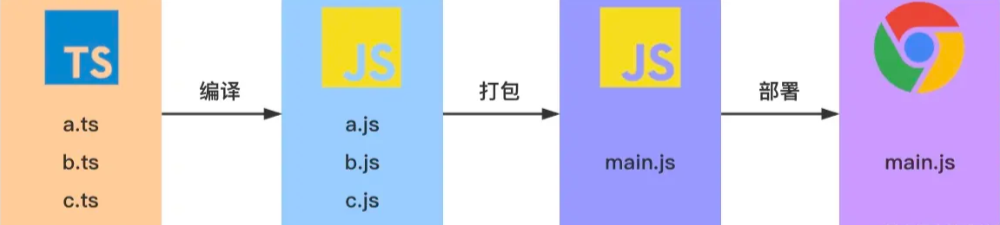

## 1.什么是 TypeScript

> Typed JavaScript at Any Scale.
> 添加了类型系统的 JavaScript，适用于任何规模的项目。

以上描述是官网[[1\]](https://ts.xcatliu.com/introduction/what-is-typescript.html#link-1)对于 TypeScript 的定义。

它强调了 TypeScript 的两个最重要的特性——类型系统、适用于任何规模。


### 类型系统

从 TypeScript 的名字就可以看出来，「类型」是其最核心的特性。

我们知道，JavaScript 是一门非常灵活的编程语言：

- 它没有类型约束，一个变量可能初始化时是字符串，过一会儿又被赋值为数字。
- 由于隐式类型转换的存在，有的变量的类型很难在运行前就确定。
- 基于原型的面向对象编程，使得原型上的属性或方法可以在运行时被修改。
- 函数是 JavaScript 中的一等公民[[2\]](https://ts.xcatliu.com/introduction/what-is-typescript.html#link-2)，可以赋值给变量，也可以当作参数或返回值。

这种灵活性就像一把双刃剑，一方面使得 JavaScript 蓬勃发展，无所不能，从 2013 年开始就一直蝉联最普遍使用的编程语言排行榜冠军[[3\]](https://ts.xcatliu.com/introduction/what-is-typescript.html#link-3)；另一方面也使得它的代码质量参差不齐，维护成本高，运行时错误多。

而 TypeScript 的类型系统，在很大程度上弥补了 JavaScript 的缺点。

### TypeScript 是静态类型

类型系统按照「类型检查的时机」来分类，可以分为动态类型和静态类型。

动态类型是指在运行时才会进行类型检查，这种语言的类型错误往往会导致运行时错误。JavaScript 是一门解释型语言[[4\]](https://ts.xcatliu.com/introduction/what-is-typescript.html#link-4)，没有编译阶段，所以它是动态类型，以下这段代码在运行时才会报错：

```js
let foo = 1;
foo.split(' ');
// Uncaught TypeError: foo.split is not a function
// 运行时会报错（foo.split 不是一个函数），造成线上 bug
```

## 2.TypeScript 与 JavaScript 的区别

| TypeScript                                     | JavaScript                                 |
| ---------------------------------------------- | ------------------------------------------ |
| JavaScript 的超集用于解决大型项目的代码复杂性  | 一种脚本语言，用于创建动态网页             |
| 可以在编译期间发现并纠正错误                   | 作为一种解释型语言，只能在运行时发现错误   |
| 强类型，支持静态和动态类型                     | 弱类型，没有静态类型选项                   |
| 最终被编译成 JavaScript 代码，使浏览器可以理解 | 可以直接在浏览器中使用                     |
| 支持模块、泛型和接口                           | 不支持模块，泛型或接口                     |
| 社区的支持仍在增长，而且还不是很大             | 大量的社区支持以及大量文档和解决问题的支持 |

## 3.典型 TypeScript 工作流程



如你所见，在上图中包含 3 个 ts 文件：a.ts、b.ts 和 c.ts。这些文件将被 TypeScript 编译器，根据配置的编译选项编译成 3 个 js 文件，即 a.js、b.js 和 c.js。对于大多数使用 TypeScript 开发的 Web 项目，我们还会对编译生成的 js 文件进行打包处理，然后在进行部署。

<Vssue/>