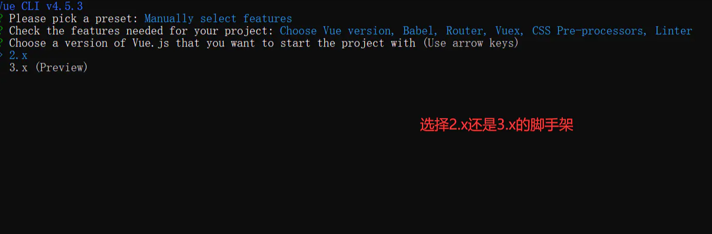

## 1.准备环境
1.Vue CLI 4.x 需要 Node.js v8.9 或更高版本，由于 v8 已不再维护，建议使用 Node.js v10 以上的版本
```js
//查看node版本
node -v
//v14.17.0
```
2. 查看npm
```js
//查看npm 版本
npm -v
//6.14.13
```
## 2.环境搭建
::: warning
由于Vue CLI 的包名称由 vue-cli改成了@vue/cli，如果之前本地有安装vue-cli(1.x 或 2.x)的脚手架需要先进行卸载
:::

```js
//卸载vue-cli(1.x 或 2.x)
npm uninstall vue-cli

//安装@vue/cl(3.x+)
npm i -g @vue/cli -g

```
## 3.项目创建
```js
vue create 项目名字（不能包含大写）
```





## 项目启动
1.进入到工程目录
2.npm run serve启动项目
