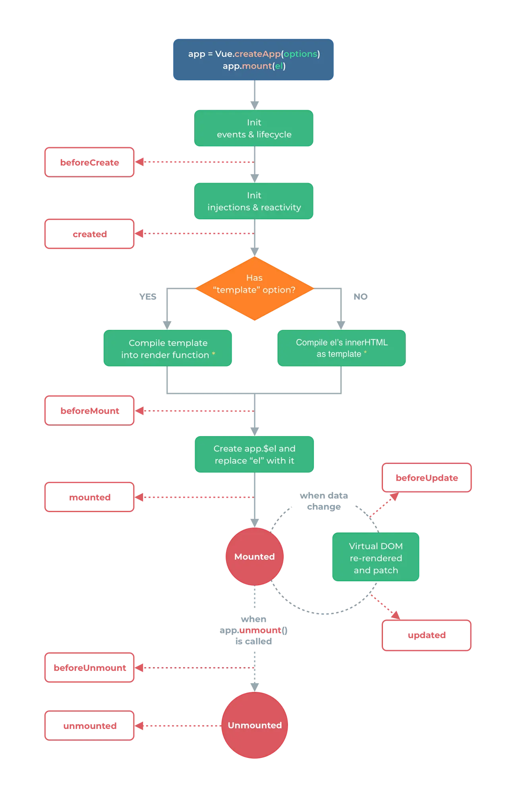

## 1.vue3和vue2生命周期对比

通过在生命周期钩子前面加上 “on” 来访问组件的生命周期钩子。

下表包含如何在 Option API 和 setup() 内部调用生命周期钩子
|               **Option API**                | **setup中**                           |
| :-----------------------------------------: | :------------------------------------ |
| <div style="width:300px">beforeCreate</div> | <div style="width:300px">不需要</div> |
|                   created                   | 不需要                                |
|                 beforeMount                 | onBeforeMount                         |
|                   mounted                   | onMounted                             |
|                beforeUpdate                 | onBeforeUpdate                        |
|                   updated                   | onUpdated                             |
|                beforeUnmount                | onBeforeUnmount                       |
|                  unmounted                  | onUnmounted                           |
|                errorCaptured                | onErrorCaptured                       |
|                renderTracked                | onRenderTracked                       |
|               renderTriggered               | onRenderTriggered                     |
|                  activated                  | onActivated                           |
|                 deactivated                 | onDeactivated                         |

## 2.图解




## 3.Options API基本使用

App.vue

```js
<template>
  <lifeCycles :msg="msg" v-if="flag" />
  <button @click="updateMsg">change message</button>
  <button @click="updateFlag">change flag</button>
</template>

<script>
import LifeCycles from './components/LifeCycles.vue'

export default {
  name: 'App',
  components: {
    LifeCycles
  },
  data() {
    return {
      msg: 'Welcome to Vue3',
      flag: true,
    }
  },
  methods: {
    updateMsg() {
      this.msg = 'Welcome to Vue3 Update ' + Date.now();
    },
    updateFlag() {
      this.flag = !this.flag;
    }
  }
}
</script>

复制代码
```

LifeCycles.vue

```js
<template>
    <p>生命周期 {{msg}}</p>
</template>

<script>
export default {
    name: 'LifeCycles',
    props: {
        msg: String
    },
    beforeCreate() {
        console.log('before create')
    },
    created() {
        console.log('created')
    },
    beforeMount() {
        console.log('before mount')
    },
    mounted() {
        console.log('mounted')
    },
    beforeUpdate() {
        console.log('before update')
    },
    updated() {
        console.log('updated')
    },
    //beforeDestory已废弃
    beforeUnmount() {
        console.log('before unmount')
    },
    //destroyed已废弃
    unmounted() {
        console.log('mounted')
    }
}
</script>

复制代码
```


## 4.Composition API基本使用

Compistion API的示例代码

LifeCycles.vue

```js
<template>
    <p>生命周期 {{msg}}</p>
</template>

<script>
import { onBeforeMount, onMounted, onBeforeUpdate, onUpdated, onBeforeUnmount, onUnmounted } from 'vue'

export default {
    name: 'LifeCycles',
    props: {
        msg: String
    },
    //等同于 beforeCreate 和 created
    setup() {
        console.log('set up');

        onBeforeMount(() => {
            console.log('before mount')
        })
        onMounted(() => {
            console.log('mounted')
        })
        onBeforeUpdate(() => {
            console.log('before update')    
        })
        onUpdated(() => {
            console.log('updated')
        })
        onBeforeUnmount(() => {
            console.log('before unmount')
        })
        onUnmounted(() => {
            console.log('mounted')
        })
    },
}
</script>

复制代码
```


## 5.为什么会有Composition API？

## 为了更好的代码组织

假设一个vue组件是一个大型组件，它的内部有很多处理逻辑的关注点(对应Options API)。有没有一种碎片化的感觉，这种碎片化使得开发者很难去理解和维护组件。 Composition API的出现就是解决这个问题的，它将某个逻辑关注点相关的代码全都放在一个函数里，这样当需要修改一个功能时，就不需要在文件中跳来跳去。 

### 示例对比

这是一个用Vue2 Option API写的一个加法组件：

- 3个参数，加数(num1)和被加数(num2)，还有一个和(sum)
- 2个input框
- 1个method

```js
<template>
    <div class="add">
        <h3>Addition Calculator</h3>
        <form id="sum">
            <input type="text" class="form-control" v-model="num1">
            <input type="text" class="form-control" v-model="num2">
            <button @click="addNumbers" type="button" class="btn btn-light">
                Add me!
            </button>
        </form>
        <p><strong>Sum:</strong> {{ sum }}</p>
    </div>
</template>
<script>
export default {
    name: 'Add',
    data() {
        return {
            num1: 0,
            num2: 0,
            sum: 0
        };
    },
    methods: {
        addNumbers: function () {
            this.sum = parseInt(this.num1) + parseInt(this.num2);
        }
    }
}
</script>
复制代码
```

改成Composition API之后

```js
<template>
    <div class="add">
        <h3>Addition Calculator</h3>
        <form id="sumComp">
            <input type="text" class="form-control" v-model="num1">
            <input type="text" class="form-control" v-model="num2">
            <button @click="addNumbers" type="button" class="btn btn-light">
            Add me!
        </button>
        </form>
        <p><strong>Sum:</strong> {{ sum }}</p>
    </div>
</template>
<script>
import { ref } from '@vue/composition-api';

export default {
    name: 'AddComposition',
    setup() {
        let num1 = ref(0);
        let num2 = ref(0);
        let sum = ref(0);
        function addNumbers() {
            sum.value = parseInt(num1.value) + parseInt(num2.value);
        }
        return {
            num1,
            num2,
            sum,
            addNumbers
        }
    }
}
</script>
复制代码
```

## 为了更好的逻辑复用

### TODO

## 6.如何选择？

- 不建议共用，会引起混乱
- 小型项目、业务逻辑简单，用Options API
- 中大型项目、逻辑复杂，用Composition API


<Vssue/>
